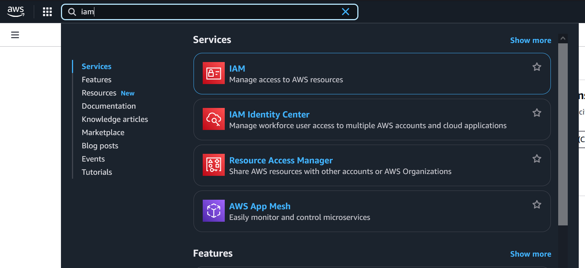
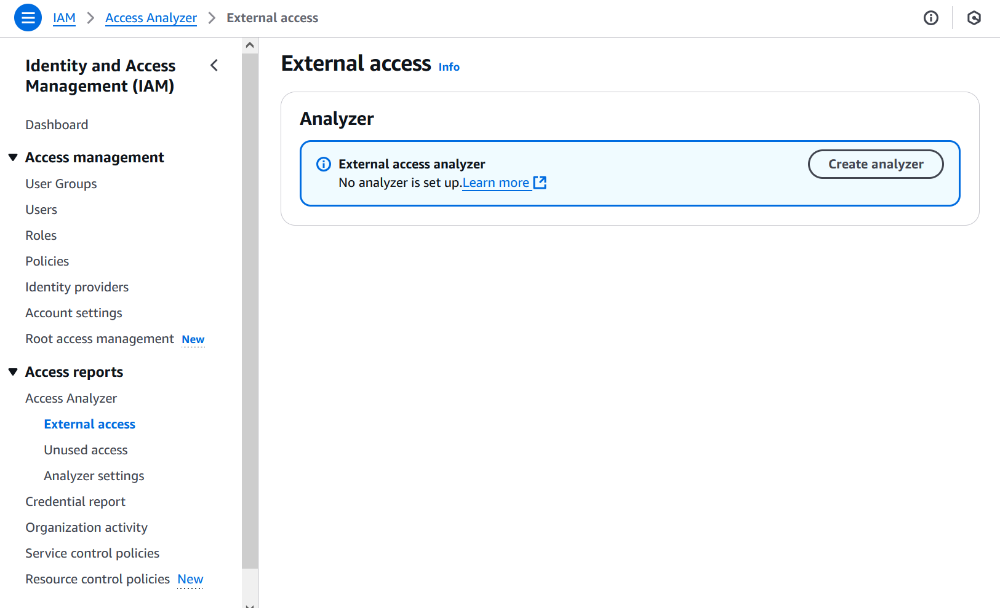
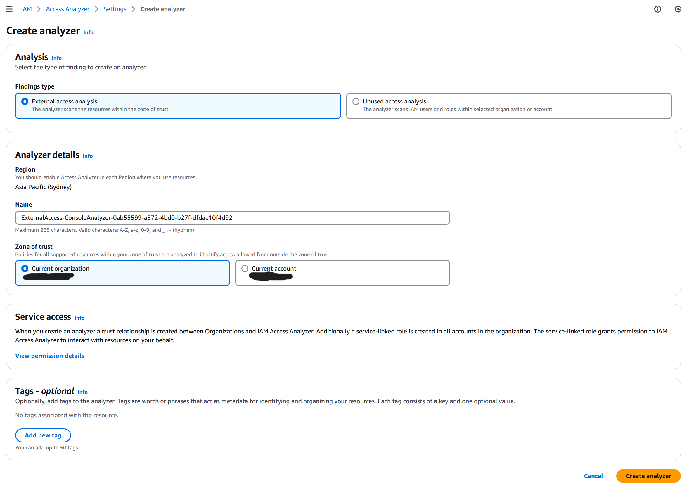
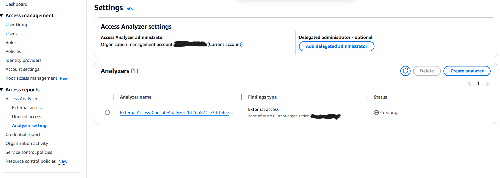
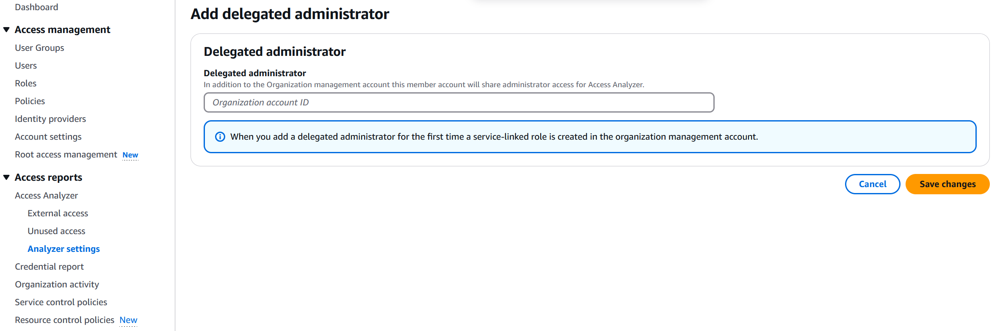

# Enable AccessAnalyzer

The following enables IAM AccessAnalyzer to detect unused and external access to the organisation.

#### Go to the ”IAM” AWS service from the search bar

#### Click on the “External Access” button on the left side

#### Click the "Create Analyzer" to create the default external access analyzer leaving the settings as default

#### Click "Access Settings" on the left side and then click "Add delegated administrator"

#### Enter the account number for the security account as the delegated administrator and click "Save changes"

