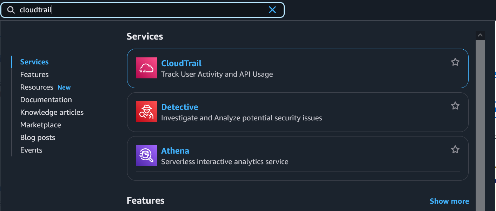
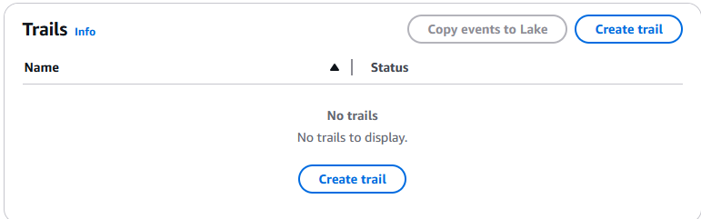
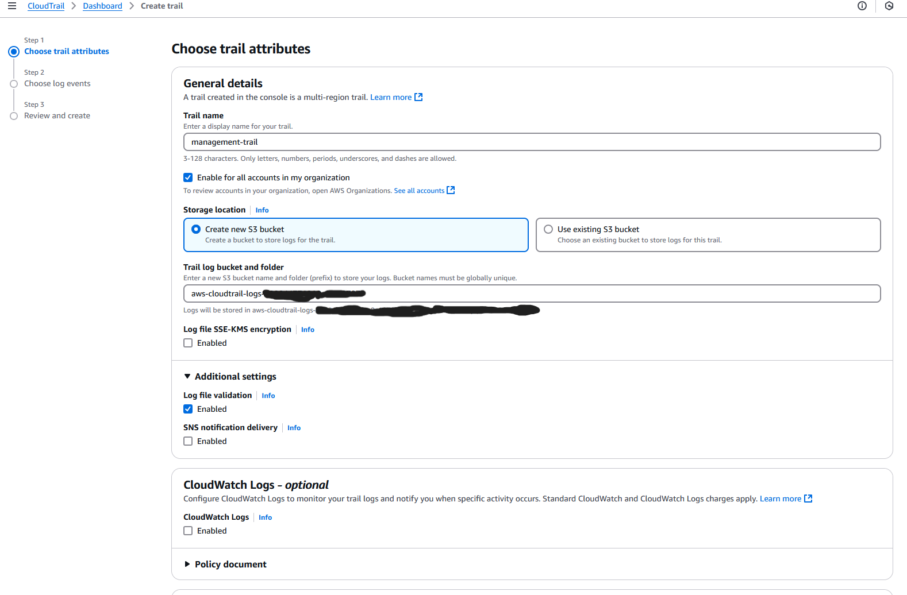
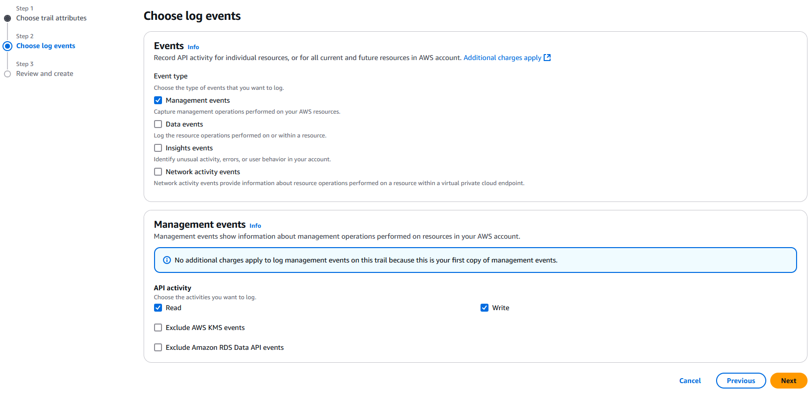

# Enable CloudTrail Logging

The following enables CloudTrail logging to increased auditability of account actions.

#### Go to the ”Cloud Trail” AWS service from the search bar.

#### Click on the "Create trail" button

#### Follow the prompts to create a trail

-   Give the trail a name and check "Enable for all accounts in my organisation"
-   It's recommended to capture at least "Management events". Further event types can be enabled, such as S3 "Data
    events"
-   Select "Create trail" on the last step

