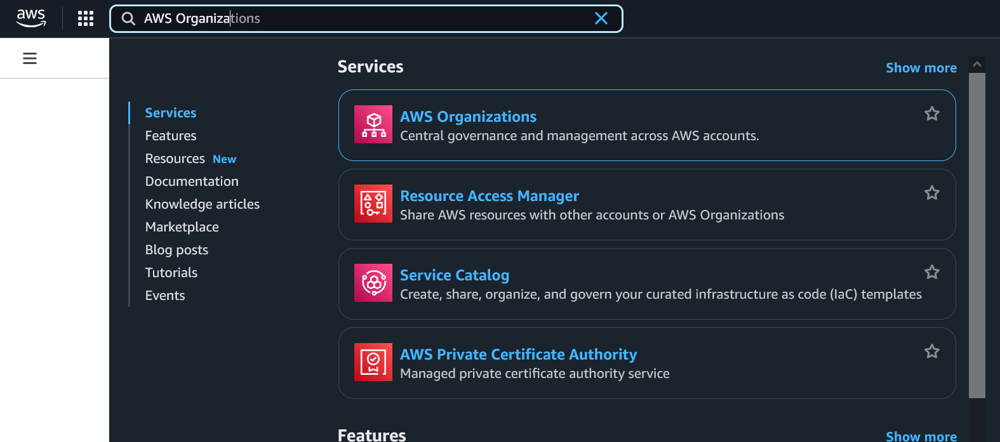
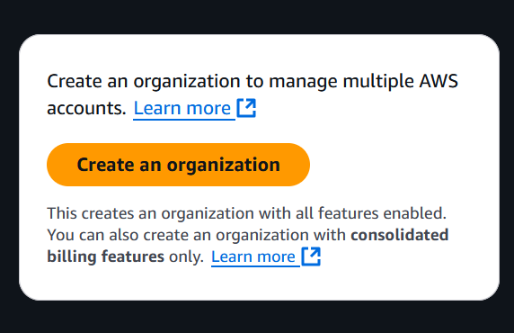

# Create organisation

Once in the management console, initially an AWS organization should be set up, with some starting accounts.

Once the base accounts are created, they should be used for everything, rather than the org root
account.

In particular we will create a
- Management account, with access only for organisation administrators. Used for delegated organisation-wide services.
- Security account, with access only for security auditors. Used for delegated security services.
- Workload account, with access for regular users. Used for actual AWS workloads.

Obviously, similar techniques can then we used to introduce accounts separating production from development,
or separating different research teams.

#### First, go to AWS Organizations in the search bar in the top left

#### Click “Create an organization” on the right side

#### Click “Add an AWS account”

![][image12]

####  Create a “Management” account, with a new email address, and click “Create AWS account”. A new email should be used \- \+ aliases are convenient to send the mail to the same inbox.

![][image13]

#### Repeat the steps for a “Security” and “Workload” account

![][image14]
![][image15]

#### The organization should now have 4 accounts in total

![][image16]

#### After the accounts are created, go to the “IAM Identity Center” in the search bar to add users that are able to login using SSO. To separate concerns, and avoid using the root account for administrative actions. The management account will be delegated to perform general organizational admin tasks, and the security account will be delegated to perform admin tasks related to security. The workload account will be given permissions to perform tasks like creating applications or pipelines using CDK.
