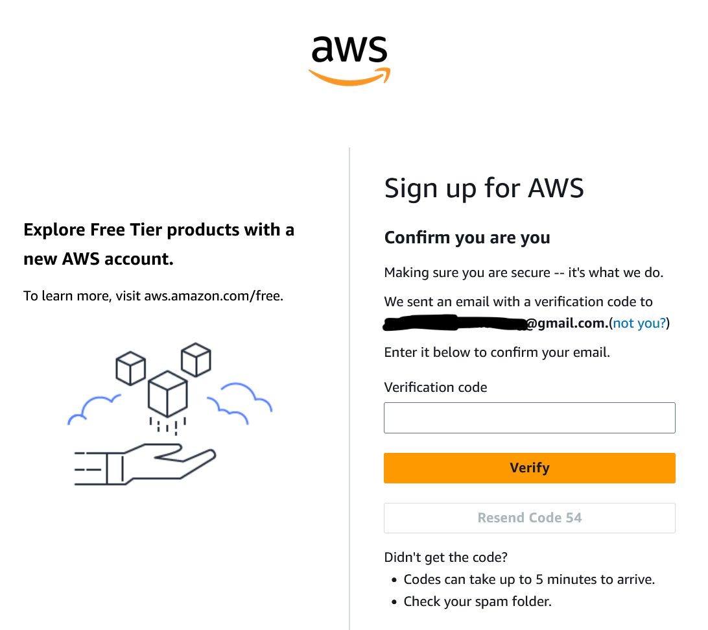
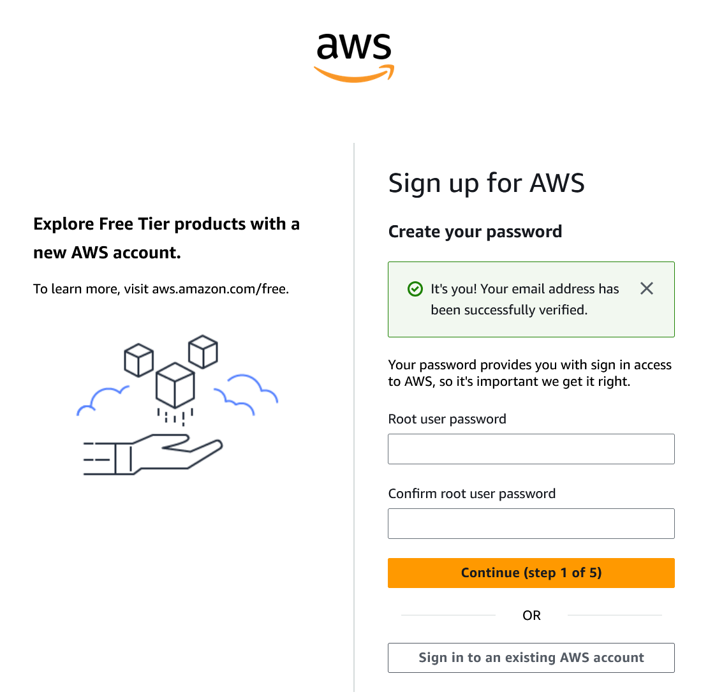
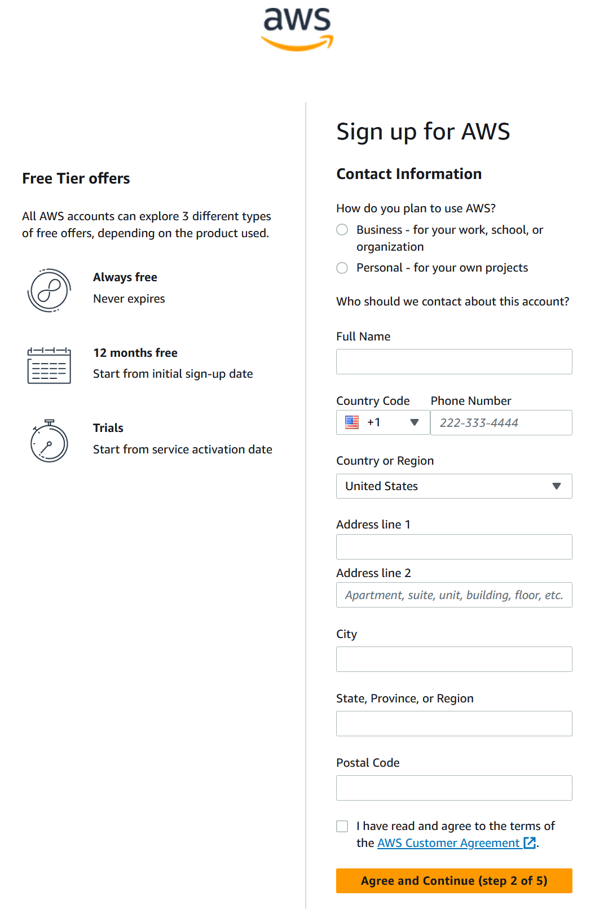
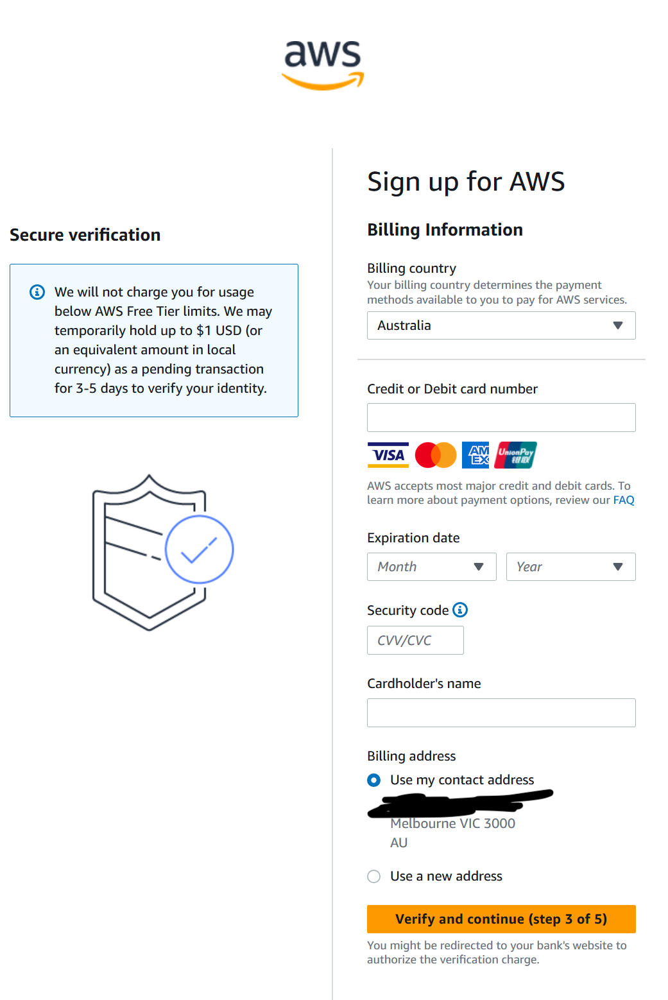
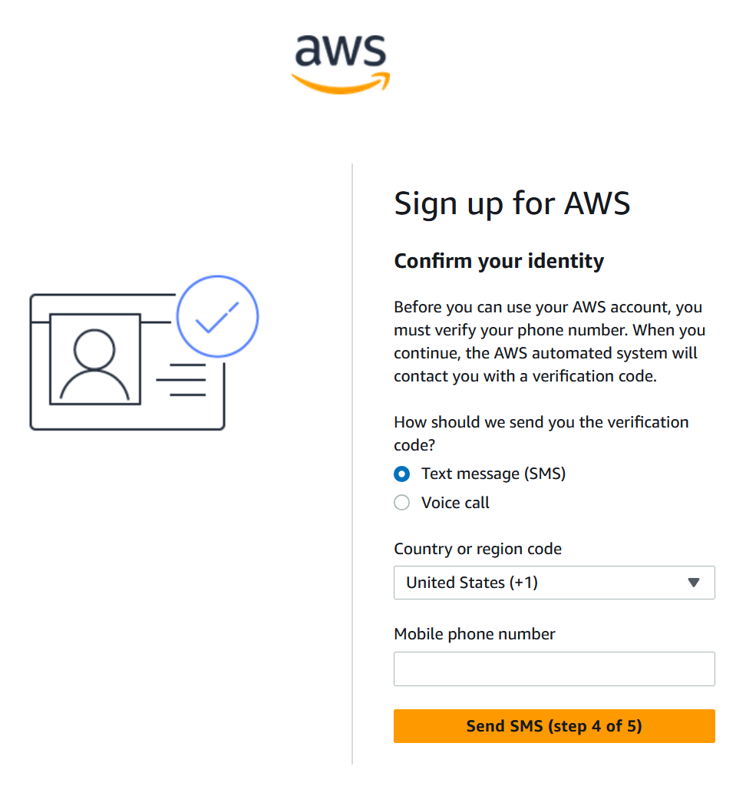
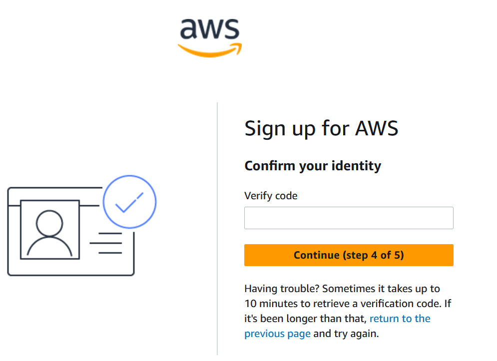
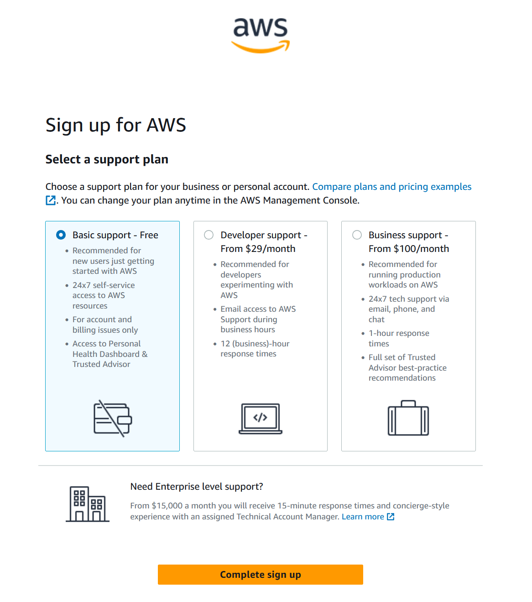
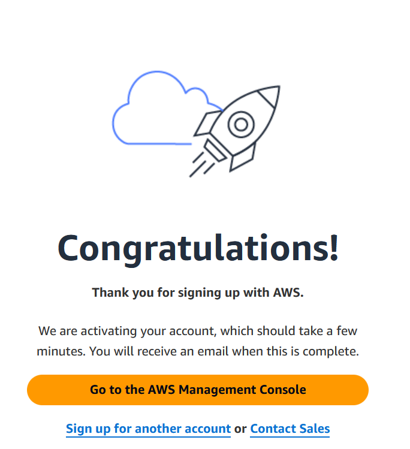

# Create Starting Account

### Create a new AWS account [https://signin.aws.amazon.com/signup?request\_type=register](https://signin.aws.amazon.com/signup?request_type=register)

#### Specify a root email and username

This email should be that of a mailing list shared amongst overall organisation administrators.

#### Verify the email address

#### Create a password

This should obviously be a very strong password and be recorded securely somewhere. There is an
opportunity to add an MFA device to this login.

This email/password combination is almost never needed in day to day operation in AWS - it is
purely for asserting ownership of the entire organisation. It is needed for this initial
setup phase though.

One long term technique that is possible is
to _not_ record the password anywhere - and require a password reset flow to be executed whenever
staff need to login via this login (see above re: the email address here should only be accessible
to overall organisation administrators).

#### Enter contact info

####  Enter card details

#### Add phone number

#### Confirm code

#### Complete sign up

#### Click “Go to the AWS Management Console”

  
