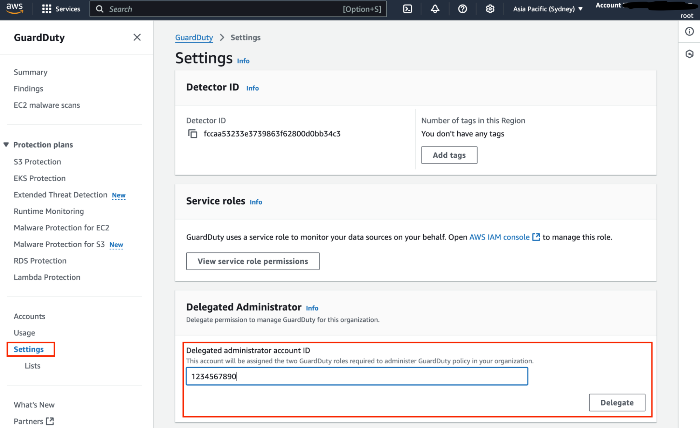

# Enable GuardDuty

The following enables GuardDuty for continuous threat detection

#### Go to the ”GuardDuty” AWS service from the search bar and click on the “Enable” button.

#### Delegate the security account to manage GuardDuty

-   On the left side bar click on “Settings”
-   On the “Delegate Administrator” box, enter the account number of the security account, then click on “Delegate”
    button

