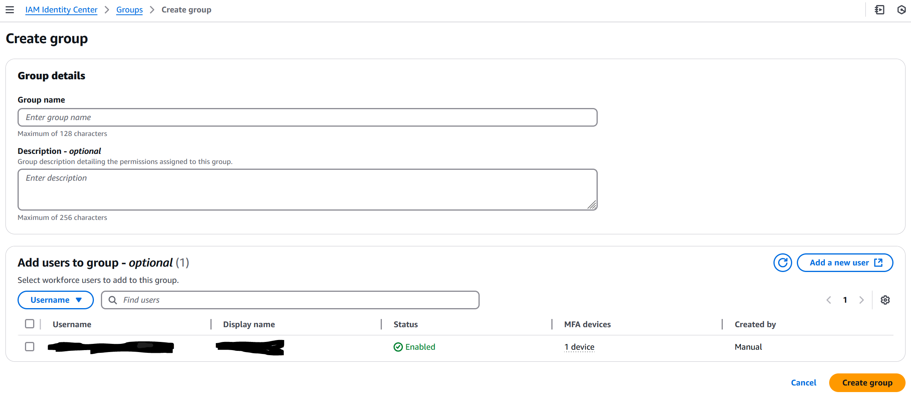
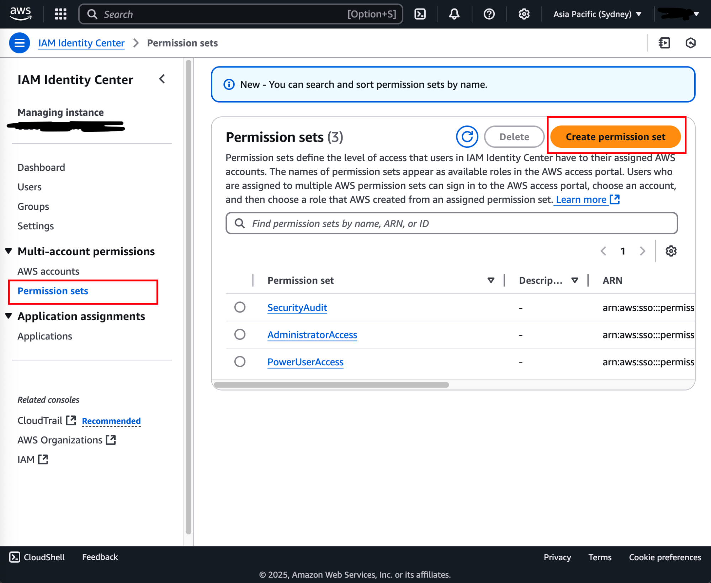

# Enable SSO

The following steps enable SSO for the AWS organisation. Once this setup is complete, SSO logins should be used for most
everyday actions in the AWS accounts, rather than using the root account.

After completing these steps, the AWS organization should have 3 user groups and permission sets for the three
accounts - management, security and workload.

#### Go to the IAM Identity Center service by using the search bar on top of the page

#### Select the appropriate region on the navigation bar on the top right of the page. Click on the “Enable” button in the region

It's recommended to select a close region, e.g. `ap-southeast-2`.

#### Add any SSO users

Add at least one user to access the AWS accounts using their email address as this will be required when setting up
SecurityHub.

#### Create user groups

Repeat the following steps until the three groups called `admin`, `research` and `security` are created.

-   On the left side bar select “Groups”
-   Select “Create group”
-   Enter the Group name as described above
-   Click on the “Create group” button at the bottom of the page
    -   Users can be specified that are allowed access to this group.

 

#### Create permission sets

Repeat the following steps until the three permission sets called `AdministratorAccess`, `PowerUserAccess` and
`SecurityAudit` are created.

-   On the left side bar of the service, select the Permission sets
-   Click on the Create permission set button
-   Follow the wizard prompt to create the permission set:
-   Select permission set type
    1. Select the Predefined permission set for the “Permission set type”
    2. Select the permission set name that matches the one listed above
-   Specify permission set details
    1. Extend the session duration in the permission set details to 12 hours
-   Review and create
    1. Click on the “Create” button

#### Assign permissions to accounts

Repeat the following steps until groups and permissions for the accounts are assigned according to the table.

| Account name | Groups     | Permission Sets                        |
| ------------ | ---------- | -------------------------------------- |
| management   | `admin`    | `AdministratorAccess`                  |
| security     | `security` | `SecurityAudit`, `AdministratorAccess` |
| workload     | `research` | `PowerUserAccess`                      |

-   On the left side bar select “AWS accounts”
-   Select on the AWS Account mentioned in the list above
-   Click on “Assign users or groups”
-   Select the groups according to the respective account
-   Select the Permission sets according to the respective account
-   Click “Submit” to apply the configuration

 

#### Delegate Management account

This delegates the management account as the admin so that it can administer settings related to SSO.

-   Click on “Settings” on the side bar
-   Click the management tab
-   Click on “Register account” in the “Delegated administrator” box
-   Select the “management” account from the selection list
-   Click on the “Register account” at the bottom of the page

Note the access portal URL on the dashboard of IAM Identity Center. This will be needed later to setup SecurityHub.
