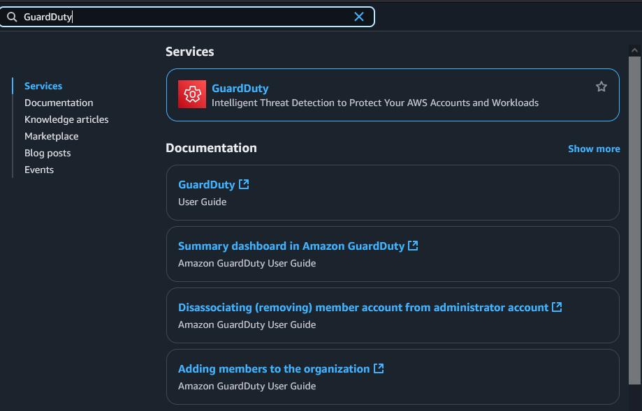
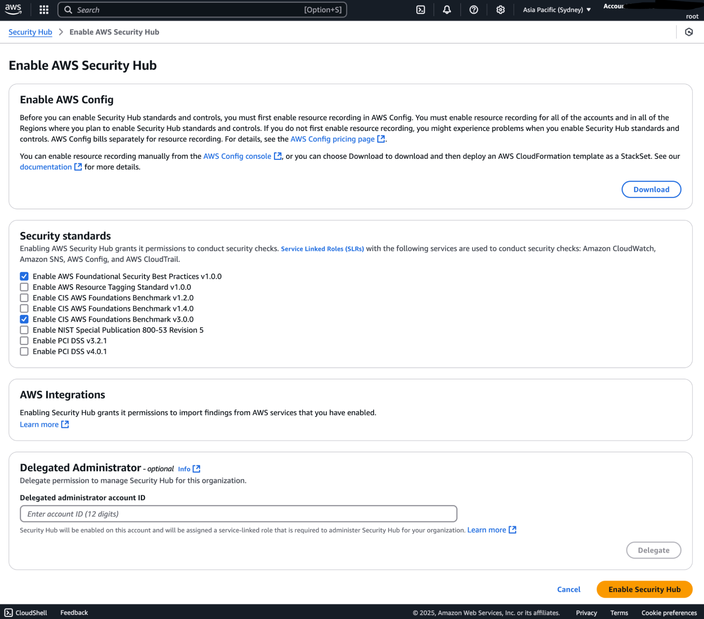
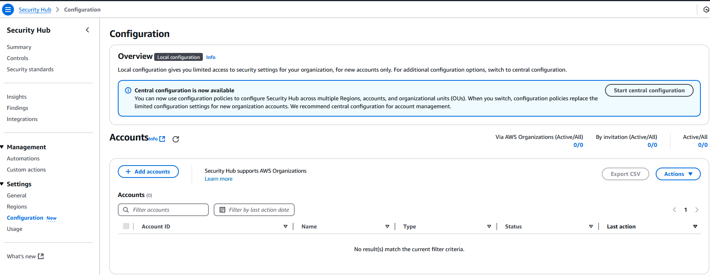
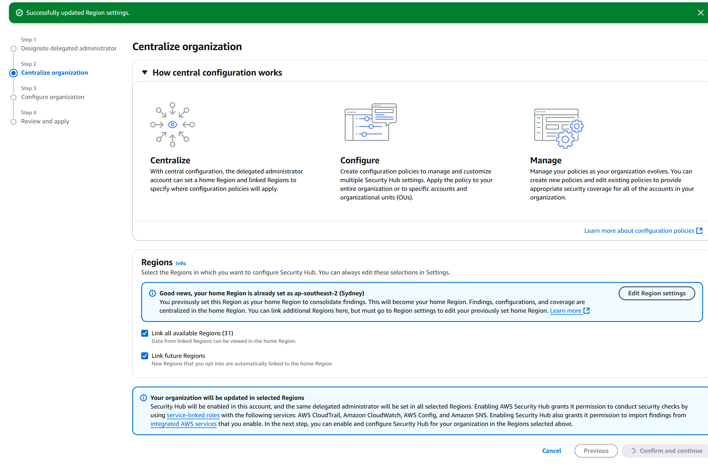

# Enable SecurityHub

The following enables SecurityHub for security checks and best practices.

#### Go to the ”Security Hub” AWS service from the search bar and click on the “Go to Security Hub” button.

#### Set the security hub standard

Enable the following:

-   AWS Foundational Security Best Practices v1.0.0
-   Enable CIS AWS Foundations Benchmark v3.0.0

#### Set the Delegate administrator to the security account

-   Under "Configuration" click "Start central configuration"
-   Set the security account as the delegated administrator.
-   Proceed with the steps until it says that you must finish the setup from the delegated account

#### Login to the delegated account as an administrator and complete the "central configuration" in SecurityHub

-   Use the SSO portal from the SSO setup to login to the delegated administrator and finish the setup.
-   Use the recommended settings and finish the setup.

